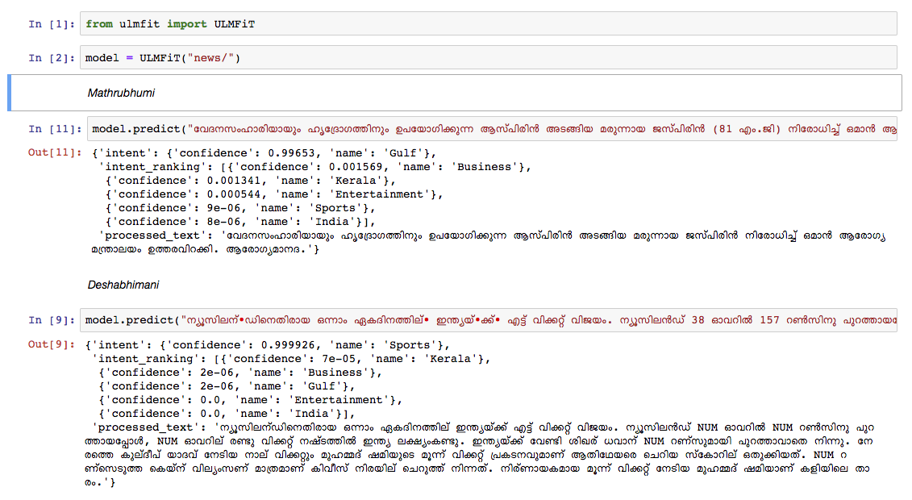

# Vaaku2Vec
State-of-the-Art Language Modeling and Text Classification in Malayalam Language
---

## Results
We trained a Malayalam language model on the Wikipedia article dump from Oct, 2018. The Wikipedia dump had 55k+ articles. The difficuly in training a Malayalam language model is *text tokenization*, since [Malayalam is a highly inflectional and agglutinative language.](https://thottingal.in/blog/2017/11/26/towards-a-malayalam-morphology-analyser/) In the current model, we are using `nltk tokenizer` (will try better alternative in the future) and the vocab size is 30k. The language model was used to train a classifier which classifies a news into 5 categories (India, Kerala, Sports, Business, Entertainment). Our classifier came out with a whooping 92% accuracy in the classification task.  

## Releases

- Proccessed wikipedia dump of articles split into test and train.
- Script and weights for Malayalam Language model.
- Malayalam text classifier with pretrained weights.
- Inference code for text classifier.

## Downloads
- [**Pretrained Malayalam Language Model**](https://www.dropbox.com/sh/a9wmsg5cjpzmyg1/AABmyHP-4bLmqrwJSB5-KeU1a?dl=0) 

- [**Pretrained Malayalam News Classifier**](https://www.dropbox.com/sh/60j4ps03j5uwz3p/AAAaMehzzsqUmSCiO9Meshc3a?dl=0) - to run only the prediction, use this.  
- Raw Datadump of malayalam wikipedia articles : [Malayalam Articles](https://dumps.wikimedia.org/mlwiki/latest/mlwiki-latest-pages-articles.xml.bz2) 

## Requirements

### Installing dependencies
python3.6>=

If you are using virtualenvwrapper use the following steps:
1. `git clone https://github.com/adamshamsudeen/Vaaku2Vec.git`
2. `mkvirtualenv -p python3.6 venv`  
3. `workon venv`
4. `cd Vaaku2Vec`
5. `pip install -r requirements.txt`

## Usage
### Training language model with  preprocessed data:
1. Download the pretrained language model folder, it contains the preprocessed test and train csv. If you would like to preproccess and retrain the LM using the latest dump article dump using the scripts provided [here](https://github.com/fastai/fastai/tree/master/courses/dl2/imdb_scripts).
2. Create tokens:  
 `python lm/create_toks.py <path_to_processed_wiki_dump>`  
eg: `python lm/create_toks.py /home/adamshamsudeen/mal/Vaaku2Vec/wiki/ml/`
3. Create a token to id mapping:  
 `python lm/tok2id.py <path_to_processed_wiki_dump>`  
eg: `python lm/tok2id.py /home/adamshamsudeen/mal/Vaaku2Vec/wiki/ml/`
4. Train language model:  
`python lm/pretrain_lm.py <path_to_processed_wiki_dump> 0 --lr 1e-3 --cl 40`  
`eg: python lm/pretrain_lm.py /home/adamshamsudeen/mal/Vaaku2Vec/wiki/ml/ 0 --lr 1e-3 --cl 40`  
`lr` is the learning rate and `cl` is the no of epochs.
 
### Training the classifier:

1. Use `train_classifier.ipynb` to train a malayalam text classifier.
2. **We have not released the news dataset, raise a request if you want to experiment with the same.**

### Testing the classifier:

1. To test the classifier trained on Manorama news, download the `Pretrained Malyalam Text Classifier ` mentioned in the downloads.
2. Use `prediction.ipynb` and test out your input.

We manually tested the model on news from other leading news paper and the model performed pretty well.

## Word2Vec:

1. We also trained a word2vec model using gensim with the Wikipedia dump.
2. You can also use word2vec model to train a text classifier. [News Classifier](https://github.com/kamalkraj/Malayalam-News-Classifier)
3. You can see the word2vec demo in the below link.

### [Demo](http://meain.io/w2vui/)

### TODO
- [x] Malayalam Language modeling based on wikipedia articles.
- [x] Release Trained Language Models weights.
- [x] Malayalam Text classifier script.
- [ ] Benchmark with [mlmorph](https://gitlab.com/smc/mlmorph) for tokenization.
- [ ] Benchmark with [Byte pair encoding for tokenization](https://nlp.h-its.org/bpemb/ml/)
- [ ] UI to train and test classifier.
- [ ] Basic Chatbot using this implementation.

## Thanks

1. **Special thanks to [Sebastian Ruder](https://github.com/sebastianruder/) and [Jeremy Howard](https://github.com/jph00) and other contributors to [fastai](https://github.com/fastai/fastai) and ULTMFiT.**  
 2. [Logo base design](https://www.behance.net/gallery/538239/Creativity)  
 3. Raeesa for designing the logo.

## Contibutors

1. [Kamal K Raj](https://github.com/kamalkraj)
2. Adam Shamsudeen
